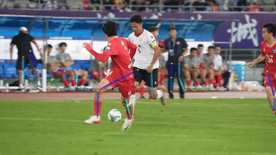

## pytorch-openpose（腿部检测版）

基于 [OpenPose](https://github.com/CMU-Perceptual-Computing-Lab/openpose) 的 PyTorch 实现（参考 [pytorch-openpose](https://github.com/Hzzone/pytorch-openpose)），本版本**仅保留腿部姿态估计**，识别左右髋、膝、踝共 6 个关键点。

> 二开作者：[Rensr0](https://github.com/Rensr0) · [rensr.site](https://www.rensr.site)

### 腿部关键点

| 编号 | 部位 |
|------|------|
| 8 | 右髋 (Right Hip) |
| 9 | 右膝 (Right Knee) |
| 10 | 右踝 (Right Ankle) |
| 11 | 左髋 (Left Hip) |
| 12 | 左膝 (Left Knee) |
| 13 | 左踝 (Left Ankle) |

### 骨骼连接

- 右腿：髋 → 膝 → 踝
- 左腿：髋 → 膝 → 踝

---

## 快速开始

### 1. 安装环境

需要 Python 3.7+，推荐使用 conda：

```bash
conda create -n pytorch-openpose python=3.7
conda activate pytorch-openpose
```

安装 PyTorch（推荐 GPU 版本以获得最佳性能），前往 [PyTorch 官网](https://pytorch.org/get-started/locally/) 按提示安装。

安装其他依赖：

```bash
pip install -r requirements.txt
```

### 2. 下载模型

模型文件 `body_pose_model.pth` 为 199MB，无法直接上传到 GitHub，请从网盘下载：

| 来源 | 链接 | 提取码 |
|------|------|--------|
| 百度网盘 | [下载链接](https://pan.baidu.com/s/1r47RZDqcIdJScpJBXfv2cw) | `t8qi` |
| Dropbox | [下载链接](https://www.dropbox.com/sh/7xbup2qsn7vvjxo/AABWFksdlgOMXR_r5v3RwKRYa?dl=0) | — |
| Google Drive | [下载链接](https://drive.google.com/drive/folders/1JsvI4M4ZTg98fmnCZLFM-3TeovnCRElG?usp=sharing) | — |

下载后将 `body_pose_model.pth` 放入项目根目录的 `model/` 文件夹：

```
openpose-leg/
├── model/
│   └── body_pose_model.pth   ← 放这里
├── src/
├── demo.py
├── demo_camera.py
└── demo_video.py
```

### 3. 运行

**摄像头实时检测：**

```bash
python demo_camera.py
```

**图片检测：**

编辑 `demo.py` 中的图片路径后运行：

```bash
python demo.py
```

**视频检测：**

```bash
python demo_video.py --file 你的视频.mp4
```

视频检测支持的参数：

| 参数 | 默认值 | 说明 |
|------|--------|------|
| `--file` | *(必填)* | 视频文件路径 |
| `--skip` | 1 | 每 N 帧处理 1 帧（1=全帧，2=处理一半） |
| `--scale` | 1.0 | 检测前缩小比例（0.5 提速明显） |
| `--boxsize` | 368 | 模型输入尺寸（256 更快，368 更准） |
| `--no-preview` | 关闭 | 关闭实时预览窗口（可提速） |

**Web 界面：**

```bash
python web/app.py
```

浏览器打开 `http://localhost:5000`，上传图片或视频即可处理。

---

## 性能优化说明

本项目已进行多项 GPU 性能优化：

- ✅ FP16 半精度推理（GPU 吞吐翻倍）
- ✅ cudnn 自动调优卷积算法
- ✅ I/O 流水线并行（读帧 + 推理并行）
- ✅ 去除不必要的深拷贝开销

没有显卡也能用，但会比较慢。CPU 模式建议加上 `--scale 0.5 --boxsize 256 --skip 3`。

---

## 项目结构

```
openpose-leg/
├── model/                    # 模型文件目录
│   └── body_pose_model.pth   # 需从网盘下载
├── images/                   # 测试图片
├── src/
│   ├── body.py               # 腿部检测核心逻辑
│   ├── model.py              # 网络模型定义
│   ├── util.py               # 绘制骨骼工具
│   └── __init__.py
├── web/
│   ├── app.py                # Web 界面后端
│   ├── templates/            # 前端页面
│   ├── uploads/              # 上传文件临时目录
│   └── output/               # 处理结果目录
├── demo.py                   # 图片检测
├── demo_camera.py            # 摄像头实时检测
├── demo_video.py             # 视频检测
├── requirements.txt          # Python 依赖
└── README.md                 # 项目说明
```

---

## Demo

#### 腿部检测结果

腿部关键点和骨架检测效果（运行 `demo.py` 或 `demo_camera.py` 查看）

#### 视频腿部检测



素材来源：抖音 https://v.douyin.com/I5Mt36skt2s/

---

## 引用

如果你在研究中使用了本项目，请引用：

```bibtex
@inproceedings{cao2017realtime,
  author = {Zhe Cao and Tomas Simon and Shih-En Wei and Yaser Sheikh},
  booktitle = {CVPR},
  title = {Realtime Multi-Person 2D Pose Estimation using Part Affinity Fields},
  year = {2017}
}

@inproceedings{simon2017hand,
  author = {Tomas Simon and Hanbyul Joo and Iain Matthews and Yaser Sheikh},
  booktitle = {CVPR},
  title = {Hand Keypoint Detection in Single Images using Multiview Bootstrapping},
  year = {2017}
}

@inproceedings{wei2016cpm,
  author = {Shih-En Wei and Varun Ramakrishna and Takeo Kanade and Yaser Sheikh},
  booktitle = {CVPR},
  title = {Convolutional pose machines},
  year = {2016}
}

本项目基于上述工作二次开发，如使用本项目的腿部分析扩展功能，可引用：

@misc{openpose-leg,
 author = {Rensr0},
 title = {OpenPose-Pro: Independent Leg Pose Analysis Extension},
 year = {2026},
 url = {https://github.com/Rensr0/openpose-leg}
}

---

## 许可证

本项目遵循 [CMU OpenPose 原始许可协议](LICENSE)（学术或非营利组织非商业研究用途），本项目为二次开发，详见 [LICENSE](LICENSE) 文件。

原始项目：[OpenPose](https://github.com/CMU-Perceptual-Computing-Lab/openpose) © Carnegie Mellon University
